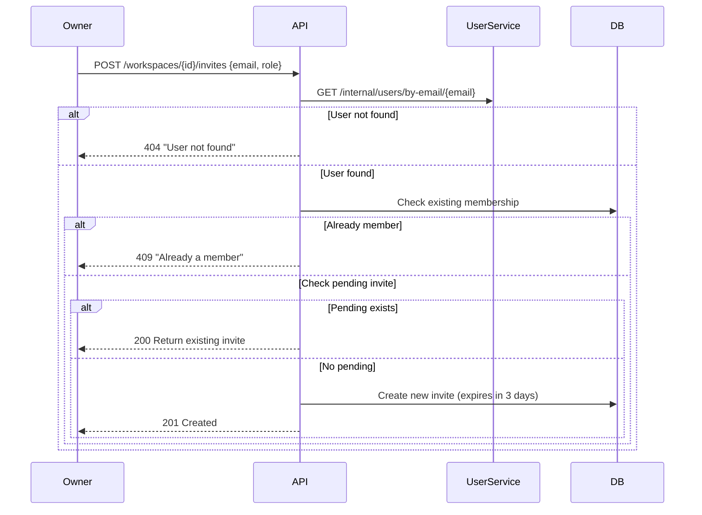
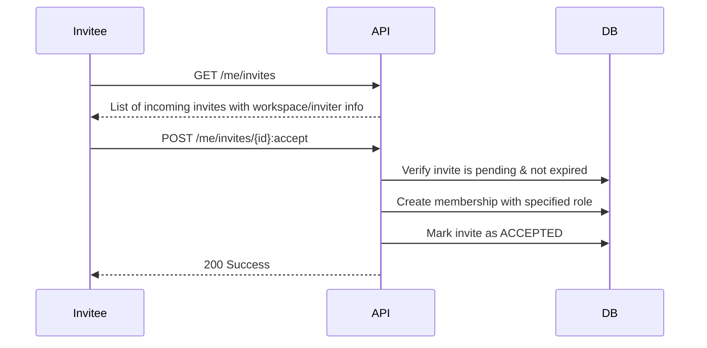

# Workspace Service

Microservice for workspace and group management in the accounting application.

## Overview

The workspace_service is the single source of truth for:
- **Workspaces** (personal & shared)
- **Memberships and roles**
- **In-app invitations**
- **Access validation** for domain services (category, expense, account, etc.)

A workspace is a data container. A group is simply a workspace with more than one member.

## Features

- Create and manage workspaces (personal and shared)
- Member management with simplified role-based access control
- In-app invitation system (no email tokens/deep links)
- Archive/unarchive workspaces
- Ownership transfer
- Internal API for domain services to validate access

## Roles & Permissions

| Role   | Permissions                                         |
|--------|-----------------------------------------------------|
| owner  | Full access, manage members & invites, transfer ownership, archive |
| full   | Read + create/update/delete workspace data          |
| read   | View workspace data only                            |

**Important:** Only the workspace owner can manage membership (invite, remove, change roles).

## API Endpoints

### Public API (Frontend/BFF)

#### Workspaces
- `POST /workspaces` - Create a new workspace
- `GET /workspaces` - List user workspaces
- `GET /workspaces/{workspace_id}` - Get workspace details
- `PATCH /workspaces/{workspace_id}` - Update workspace (rename)
- `POST /workspaces/{workspace_id}:archive` - Archive workspace
- `POST /workspaces/{workspace_id}:unarchive` - Unarchive workspace
- `POST /workspaces/{workspace_id}:leave` - Leave workspace
- `POST /workspaces/{workspace_id}/owner:transfer` - Transfer ownership

#### Members
- `GET /workspaces/{workspace_id}/members` - List workspace members (any member)
- `PATCH /workspaces/{workspace_id}/members/{user_id}` - Update member role (owner only)
- `DELETE /workspaces/{workspace_id}/members/{user_id}` - Remove member (owner only)

#### Workspace Invites (Owner Operations)
- `POST /workspaces/{workspace_id}/invites` - Create invite by email (owner only)
- `GET /workspaces/{workspace_id}/invites` - List pending invites (owner only)
- `DELETE /workspaces/{workspace_id}/invites/{invite_id}` - Cancel invite (owner only)

#### My Invites (Invitee Operations)
- `GET /me/invites` - List incoming invites for current user
- `POST /me/invites/{invite_id}:accept` - Accept invite
- `POST /me/invites/{invite_id}:reject` - Reject invite

### Internal API (Domain Services)

- `POST /internal/workspaces/{workspace_id}/authorize` - Check user authorization
- `GET /internal/users/{user_id}/workspaces` - Get user's workspaces
- `GET /internal/users/{user_id}/default-workspace` - Get default workspace
- `POST /internal/workspaces/personal` - Create personal workspace (registration)
- `GET /internal/workspaces/{workspace_id}/role/{user_id}` - Get user role

## Invitation Flow

### Creating an Invite (Owner)



### Accepting/Rejecting (Invitee)



## Invite Statuses

| Status    | Description                              |
|-----------|------------------------------------------|
| pending   | Waiting for invitee response             |
| accepted  | Invitee accepted, membership created     |
| rejected  | Invitee explicitly declined              |
| expired   | 3 days passed without response           |
| canceled  | Owner canceled the invitation            |

## Business Rules

### Invite Creation
1. Owner invites by email
2. User with email must exist → else error "user not found"
3. Cannot invite yourself
4. Cannot invite existing active member

### Invite Uniqueness & Re-invite
1. Only one PENDING invite per (workspace_id, invitee_user_id)
2. If PENDING invite exists → return existing invite (idempotent)
3. If status is EXPIRED/REJECTED/CANCELED → allow new invite
4. If member was removed → can be re-invited

### Invite Expiration
- Invites expire 3 days from creation
- Expired invites cannot be accepted/rejected
- Owner can send new invite after expiration

## Configuration

Environment variables:

| Variable | Description | Default |
|----------|-------------|---------|
| `DATABASE_URL` | PostgreSQL connection string | Required |
| `SECRET_KEY` | JWT secret key | Required |
| `ALGORITHM` | JWT algorithm | `HS256` |
| `INTERNAL_SECRET_TOKEN` | Token for internal service auth | Required |
| `CORS_ORIGINS` | Allowed CORS origins | `http://localhost:3000,...` |
| `LOG_LEVEL` | Logging level | `INFO` |
| `INVITE_EXPIRE_DAYS` | Invite expiration in days | `3` |
| `USER_SERVICE_URL` | User service URL | `http://user_service:8000` |

## Database Schema

### workspaces
- `id` (UUID, PK)
- `name` (string)
- `type` (personal | shared)
- `owner_user_id` (int)
- `created_at`, `updated_at`, `archived_at`

### workspace_members
- `id` (int, PK)
- `workspace_id` (UUID, FK)
- `user_id` (int)
- `role` (owner | full | read)
- `status` (active | left | removed)
- `joined_at`, `created_at`, `updated_at`

### workspace_invites
- `id` (UUID, PK)
- `workspace_id` (UUID, FK)
- `inviter_user_id` (int)
- `invitee_user_id` (int, NOT NULL)
- `invitee_email` (string, NOT NULL)
- `role` (full | read)
- `expires_at` (datetime)
- `status` (pending | accepted | rejected | expired | canceled)
- `created_at`, `updated_at`, `accepted_at`, `responded_at`

**Indexes:**
- Partial unique index on `(workspace_id, invitee_user_id)` WHERE `status = 'pending'`
- Index on `invitee_user_id` for "my invites" queries
- Index on `status` for filtering

## Security

- Access requires active membership
- Only owner can manage members and invites
- Owner cannot be removed without ownership transfer
- Invites are time-limited (3 days)
- Only one pending invite per workspace+user

## Edge Cases to Test

### Invite Creation
- [ ] Invite non-existent email → 404
- [ ] Invite yourself → 400
- [ ] Invite active member → 409
- [ ] Duplicate pending invite → return existing (idempotent)
- [ ] Re-invite after rejection → new invite created
- [ ] Re-invite after expiration → new invite created
- [ ] Re-invite after cancel → new invite created
- [ ] Non-owner tries to invite → 403
- [ ] Invite to archived workspace → 400

### Invite Response
- [ ] Accept pending invite → membership created with correct role
- [ ] Accept expired invite → 410 (auto-marks as expired)
- [ ] Accept already accepted → 400
- [ ] Accept someone else's invite → 403
- [ ] Reject pending invite → status = rejected
- [ ] Accept invite to archived workspace → 400

### Member Management
- [ ] Non-owner changes role → 403
- [ ] Owner changes member role (read ↔ full) → success
- [ ] Owner tries to change owner role → 400
- [ ] Non-owner removes member → 403
- [ ] Owner removes member → status = removed
- [ ] Owner tries to remove owner → 400
- [ ] Re-invite removed member → success (reactivates)

## Running Locally

```bash
# Install dependencies
poetry install

# Run migrations
alembic upgrade head

# Start server
uvicorn app.main:app --reload --port 8000
```

## Docker

The service is configured in `docker-compose.yml` and runs on port `8012`.

```bash
docker-compose up workspace_service
```

## Integration with Other Services

During user registration, `user_service` should call:
```
POST /internal/workspaces/personal
{ "user_id": "..." }
```

This creates a personal workspace and returns the `workspace_id` for storage.

Domain services can validate access using:
```
POST /internal/workspaces/{workspace_id}/authorize
{ "user_id": "...", "required_role": "full" }
```

Returns `200` with role info or `403` if unauthorized.
